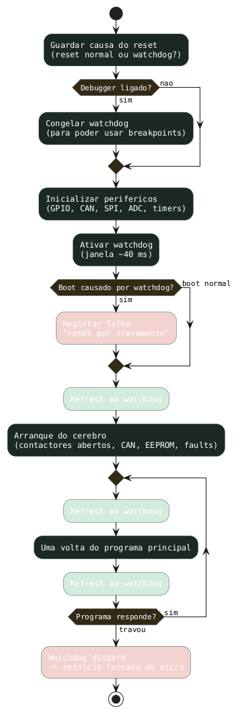
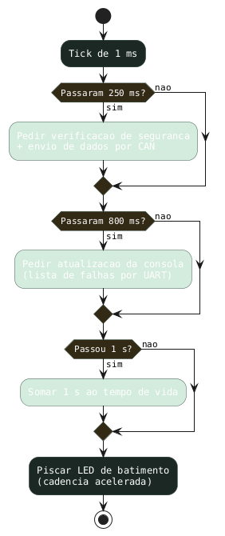
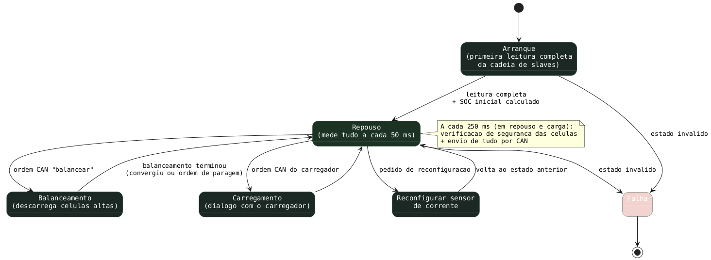
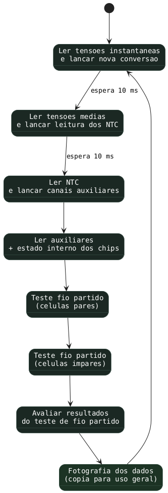
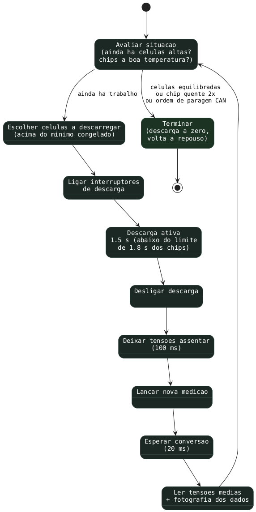
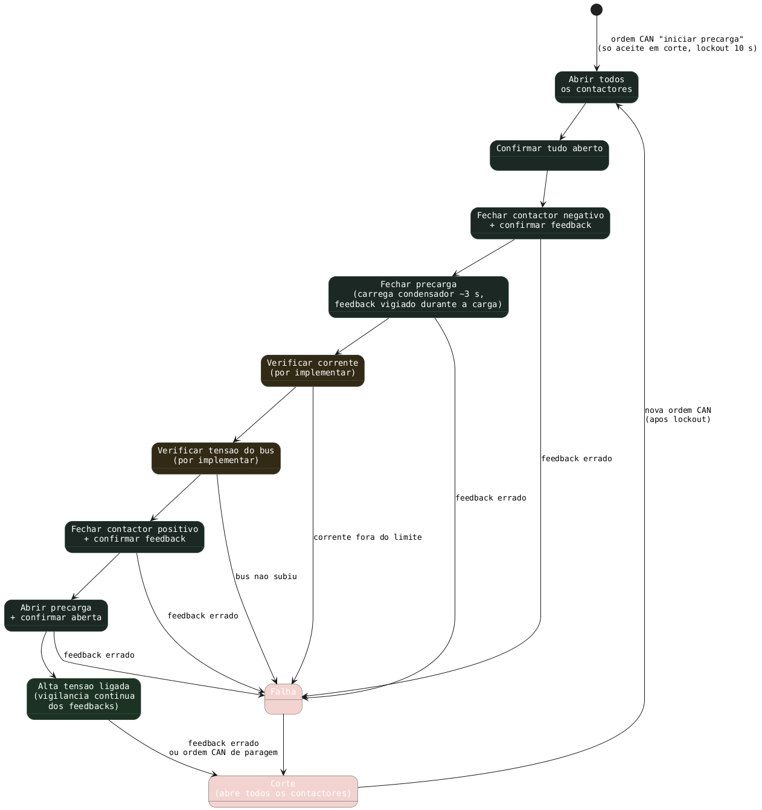

# lart_bms — Fluxogramas (PlantUML)

Fluxos das partes críticas do firmware, em linguagem humana — os nomes de código ficam só nas notas de rodapé de cada secção. Copia cada bloco `@startuml…@enduml` para o editor PlantUML.

Cores: verde = sucesso/OK · amarelo = decisão/espera · vermelho = falha.

---

## 01 — Arranque & Watchdog

O watchdog é um "cão de guarda" por hardware: se o programa principal travar e deixar de lhe fazer refresh, o micro é reiniciado à força. A causa do reset é guardada logo no arranque, antes de ativar o watchdog, para se saber se o boot veio de um reset normal ou de um travamento.

> Código: `main.c` — WWDG presc 8 / window 127 / counter 127, refresh antes e depois de `brain_loop()`, causa do reset em `RCC->CSR` → `watchdog_flag`.

---

## 02 — Relógio interno de tarefas (1 ms)

Uma interrupção de 1 ms serve de metrónomo: não faz trabalho pesado, só levanta bandeiras. O programa principal vê as bandeiras e executa as tarefas na volta seguinte.

> Código: `brain.c · HAL_SYSTICK_Callback` — flags `faultCheck` (250 ms), `updateUI` (800 ms), `runtime_sec` (1 s), `heartbeat()`.

---

## 03 — Estados principais do AMS

O AMS vive num de poucos modos. Arranca em "primeira leitura", passa a repouso, e só sai de repouso por ordem via CAN (balancear ou carregar). Qualquer estado inválido cai em falha.

> Código: `brain.c · brain_loop` — `AMSStates_t`: STARTUP, IDLE, BALANCING, CHARGING, RESET_ISA, FAULT.

---

## 04 — Ciclo de medição em repouso

As leituras aos slaves são feitas por fases curtas, sem nunca bloquear o programa: dispara-se a conversão, sai-se, e volta-se mais tarde para ler o resultado. No fim testa-se fio partido (open wire) e tira-se uma "fotografia" dos dados para o resto do firmware usar.

> Código: `adBms_Application.c · adbms_main` — fases `ADBMS_IDLE_*`, RDCV/RDAC/RDAUX/RDRAX/RDSTAT, open-wire par/ímpar, `memcpy(SLAVE, IC, …)`.

---

## 05 — Ciclo de balanceamento

Descarrega → pára → deixa assentar → mede → recalcula. O pulso de descarga tem de ficar **abaixo de 1.8 s**: os chips têm um watchdog interno que, sem comandos, apaga os interruptores de descarga e adormece. Há ainda uma guarda térmica — se o chip aquecer demasiado 2 ciclos seguidos, o balanceamento termina com falha registada.

> Código: `adBms_Application.c · BAL_CYCLE_*` — `BALANCE_ON_TIME_MS = 1500` < tSLEEP 1.8 s, `BALANCE_SETTLE_MS = 100`, guarda die-temp 85 °C ×2, alvo = mínimo congelado no arranque da sessão.

---

## 06 — Sequência de precarga

Fecha os contactores por ordem, confirmando o retorno (feedback) de cada um antes de avançar. O condensador do bus é carregado através da resistência de precarga antes de fechar o contactor positivo — senão a corrente de choque soldava-o. Qualquer confirmação errada aborta e abre tudo.

> Código: `precharge.c · Precharge_Update` — `PrechargeState_t`; "Falha" = `WRONG`, "Corte" = `KILL`; verificações de corrente/bus são stubs (`IsCurrentOK`/`IsBusVoltageOK` devolvem `true`) — pontos de entrada da futura camada de proteção.
