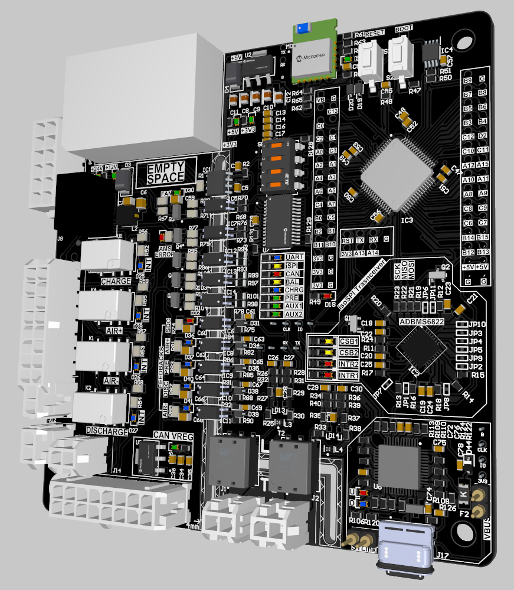

# BMS STM32F412 + ADBMS6830



Simple Battery Management System firmware for an STM32F412 master board using Analog Devices ADBMS6830 battery-monitor ICs.

The project reads cell voltages, temperatures, current sensor data and contactor feedback, then sends the important information over CAN to the Powertrain Bus.

## Main hardware

- STM32F412RET6 microcontroller
- ADBMS6830 battery monitoring ICs
- isoSPI daisy chain for the BMS slaves
- CAN bus for telemetry and commands
- External EEPROM for saved configuration
- IVT-S current / voltage sensor
- Precharge, AIR+, AIR- and discharge contactors
- PWM fan output

## Main features

- Cell voltage measurement
- Thermistor temperature measurement
- Open-wire detection
- Passive cell balancing
- Precharge state machine
- Contactor feedback service
- CAN telemetry using `powertrain_t26.dbc`
- Fault manager with active fault tracking
- SOC estimate using cell voltage and IVT-S ampere-second counter
- UART debug output using DMA
- Watchdog reset detection
- CAN bootloader jump command

## Basic firmware flow

1. `main.c` initializes the STM32 peripherals.
2. `brain_start()` initializes CAN, EEPROM, fan control, analog readings, IVT-S, precharge and fault handling.
3. `brain_loop()` runs forever.
4. Depending on the BMS state, the firmware reads the ADBMS6830 chain, balances cells, checks faults and sends CAN messages.
5. If a serious fault happens, the system can open the contactors and move to a safe state.

## CAN communication

The firmware uses the `powertrain_t26.dbc` and `handcart_t26.dbc` files.

CAN is used for:

- Slave cell voltages
- Slave temperatures
- Module status
- Master board status
- Fault reporting
- IVT-S sensor readings
- Precharge commands
- Cell balancing commands
- Bootloader jump command

## Cell balancing

Balancing is passive and controlled through the ADBMS6830 discharge outputs.

The firmware:

- Finds the lowest valid cell voltage in the Accumulator
- Compares every cell against that minimum
- Enables discharge on cells that are too high
- Stops balancing when the cells are inside the configured delta

## Fault handling

The fault manager tracks active faults and stores context such as:

- Time of the fault
- Measured value
- Threshold value
- Slave index
- Cell index
- CAN channel
- Contactor mismatch bits

Faults are also sent over CAN.

## Build target

This project is made for STM32CubeIDE / STM32 HAL and targets:

```text
STM32F412RET6
```
